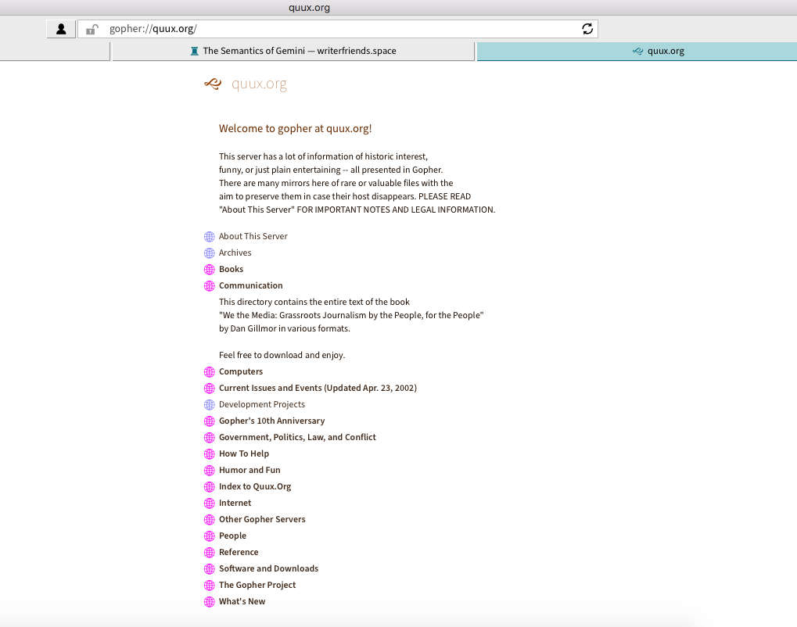

## Gopher

Over the course of the workday I'll do routine things like browse Stack Overflow, tinker around with a React feature in a codesandbox someone made, check Twitter real quick, Google an obscure error message, and so on. And sometimes I'll find myself thinking that surely this _is_ the Internet, and this must be how everyone interacts with the web.

Of course, the Internet is not those things. It isn't those things now, and it never was those things. It's completely incidental that we even have Google, Twitter, JavaScript, or HTTP, or even the Internet at all, for that matter.

The incidental nature of the modern web becomes a bit more apparent when you consider that there was (and still is) an alternative to what we think of as the web, which was the [Gopher](<https://en.wikipedia.org/wiki/Gopher_(protocol)>) protocol. In the Gopher model, when you visit a site in 'Gopherspace', you're presented with a plain text menu that you can use to access sub menus or text documents.

<figure>
  
  <figcaption>Quux gopher server viewed in Lagrange Gopher/Gemini client.</figcaption>
</figure>

It's a rigid hierarchical structure that's different from the sprawling web that constitutes what we usually think of as the Internet. Although Gopher can send binaries and some image formats, most content is plain text. And there is no notion of enriching this text via any sort of styling or interactivity, that's purely a web concept.

There aren't that many Gopher servers around, but there is definitely still a dedicated community who argue that Gopher is [still relevant](http://gopher.floodgap.com/overbite/relevance.html) today.

## The Gemini Project

[Gemini](https://gemini.circumlunar.space/) is another alternative to both the web and Gopher that emerged in 2019. This protocol aims to be a middle ground between the minimalist austerity of Gopher and the [overwhelming](https://how-i-experience-web-today.com/) abundance of the web.

I discovered the existence of both Gemini and Gopher when someone [posted](https://news.ycombinator.com/item?id=29291392) a link to the [Lagrange](https://github.com/skyjake/lagrange) Gopher/Gemini client (seen in the screenshot above) on Hacker News, and have been almost mesmerized by it ever since.

Reading Gemini's [design philosophy](https://gemini.circumlunar.space/docs/faq.gmi) is remarkably poignant as it represents a clear and well-articulated yearning for a purer, idea-oriented Internet. This yearning is embedded in the protocol design. I highlight a few interesting features here, but the FAQ linked above definitely deserves its own read. Consider the following Gemini protocol features:

1. Gemini supports exactly one response header, `Content-Type`.

This means there is no support for cookies or any other tracking mechanism that could potentially be injected into the server response. Section 2.12 of the FAQ, "Why isn't there an equivalent of the HTTP Content-length header?" provides a beautiful justification for this design choice:

> Non-extensibility of the protocol was a major design principle for Gemini. Things like cookies, Etags and other tracking tools were not present in the original design of HTTP, but could be seamlessly added later because the HTTP response format is open-ended and allows the easy inclusion of new headers. To minimise the risk of Gemini slowly mutating into something more web-like, it was decided to include one and exactly one piece of information in the response header for successful requests. Including two pieces of information with a specified delimiter would provide a very obvious path for later adding a third piece - just use the same delimiter again. There is basically no stable position between one piece of information and arbitrarily many pieces of information, so Gemini sticks hard to the former option, even if it means having to sacrifice some nice and seemingly harmless functionality. Given this restriction, including only an equivalent of Content-type seemed clearly more useful than including only an equivalent of Content-length. The same is true for other harmless and useful HTTP headers, like Last-Modified.

The idea of putting hard limitations in place to ensure the community remains safe from invasive tracking technologies is deeply compelling.

2. Gemini's 'native' content type, `text/gemini` has no support for styling

Whereas CSS can be embedded in the web's 'native' content type, HTML, via `style` tags or inline styles, Gemini's [gemtext](https://gemini.circumlunar.space/docs/gemtext.gmi) markup language has no such facilities. This language is inspired by Markdown, but has a few key differences, e.g only supporting three levels of headings, no nested lists, etc.

The idea here is that the protocol designers put styling in the hands of the readers, not the content creators, thus section 2.11, "Why doesn't text/gemini have support for styling?" :

> While it's true that something much simpler and lighter than CSS could easily be designed, Gemini instead takes the position that visual styling of Gemini content should be under the sole and direct control of the reader, not the writer. Not everybody has the same taste in colours and fonts, and no single way of styling a page will be optimal for all readers, all devices and all lighting conditions. There is much more at stake here than the age old divide in preference for dark text on a light background or vice versa. People with reading disabilities like dyslexia may benefit tremendously from using specially designed fonts, for example.
>
> ...
>
> Experience from the web suggests that accessibility issues will often be an afterthought at best. It's much simpler, and in fact much more liberating for content authors, to let content just be content, and leave styling to the client.

The [list of Gemini clients](https://gemini.circumlunar.space/clients.html), contains terminal clients as well as GUI clients that pay a little more attention to style. It's up to the user to decide how they want to consume Gemini content.

There is nothing stopping anyone from serving html over Gemini with a mimetype of `text/html`, and someone else creating a Gemini client that parses it and renders it with CSS, JS, etc. But that would really be missing the point.

3. The very fact that Gemini is a different protocol from HTTP.

What resonated the most with me was the answer to the obvious question asked in section 2.5, "Why not just use a subset of HTTP and HTML?" This gets at the heart of the Gemini project. There are plenty of websites out there that have little to no styling but still host amazing content. Why bother with creating a new protocol? The answer:

> The problem is that deciding upon a strictly limited subset of HTTP and HTML, slapping a label on it and calling it a day would do almost nothing to create a clearly demarcated space where people can go to consume _only_ that kind of content in _only_ that kind of way. It's impossible to know in advance whether what's on the other side of a https:// URL will be within the subset or outside it. It's very tedious to verify that a website claiming to use only the subset actually does, as many of the features we want to avoid are invisible (but not harmless!) to the user. It's difficult or even impossible to deactivate support for all the unwanted features in mainstream browsers, so if somebody breaks the rules you'll pay the consequences. Writing a dumbed down web browser which gracefully ignores all the unwanted features is much harder than writing a Gemini client from scratch. Even if you did it, you'd have a very difficult time discovering the minuscule fraction of websites it could render.
>
> Alternative, simple-by-design protocols like Gopher and Gemini create alternative, simple-by-design spaces with obvious boundaries and hard restrictions. You know for sure when you enter Geminispace, and you can know for sure and in advance when following a certain link will cause you leave it. While you're there, you know for sure and in advance that everybody else there is playing by the same rules. You can relax and get on with your browsing, and follow links to sites you've never heard of before, which just popped up yesterday, and be confident that they won't try to track you or serve you garbage because they _can't_. You can do all this with a client you wrote yourself, so you **know** you can trust it. It's a very different, much more liberating and much more empowering experience than trying to carve out a tiny, invisible sub-sub-sub-sub-space of the web

Gemini provides guarantees about content that do not and cannot exist on the web.

## The Small Internet

Knowing a bit more about Gemini, I highly encourage you to download a client and go for a walk through Geminispace. The Gemini search engine lives at `gemini://geminispace.info/`. Point your client there and look for whatever you like. Browsing through people's sites (called "capsules" in Geminspace) is delightful, and feels liberating to me in the way I believe the creators intended.

One capsule I found has [an interesting post](gemini://writerfriends.space/essays/semantics.gmi) outlining the way publishing in Geminispace differs from publishing on the web. Gemtext doesn't support inline links the way Markdown does, every link has to be its own line. It's a small difference, but it forces you to think more deeply about where to put your links, and what content deserves to be linked to, since links are much less subtle in gemtext. The result is typically longer blocks of text - more of the author's own thoughts on a subject instead of just a vehicle for links that lead to other places.

To many people, plentiful linking is what makes the web great, in which case Gemini might not be the best option. The Gemini maintainers fully acknowledge this, and it is not the intention of the project to replace Gopher or the web, but to coexist with them for the benefit of people who want to experience a particular flavour of content.

Maya makes an [interesting point](https://maya.land/monologues/2021/01/11/the-tragedy-of-gemini.html) when she says that maybe the reason that Geminispace feels so good is because it's new and only accessible to people who have at least some technical inclinations. To get on there requires a little bit more effort than just hitting the Tweet button (but not [that much](https://gemlog.blue/)).

Her sentiment that Gemini "is a grail quest for the Eternal August, before webscale crushed the things we love" feels heartbreakingly true. It would be great if more people discovered Geminispace, but then maybe the community would have to contend with a deterioration in the content.

Or maybe not. I'm choosing to remain optimistic and excited about the future of the Gemini project. There is so much out there to discover - so many tiny, hidden capsules, so much wonder.

### Links

[Gemini Project home page](https://gemini.circumlunar.space/)

[Gemini list of clients](https://gemini.circumlunar.space/clients.html)

Geminispace search engine [HTTP version](https://gemini.circumlunar.space/x/geminispace.info/) | [Gemini version](gemini://geminispace.info/)

 

---

### References

Kaiser, Cameron. “Why Is Gopher Still Relevant?” Overbite Project: Why Still Use Gopher? What Makes Gopher Relevant?, http://gopher.floodgap.com/overbite/relevance.html.

Maya. “The Tragedy of Gemini.” Maya.land, 12 Jan. 2021, https://maya.land/monologues/2021/01/11/the-tragedy-of-gemini.html.

Project Gemini, https://gemini.circumlunar.space/.

“The Semantics of Gemini.” Writerfriends.space, gemini://writerfriends.space/essays/semantics.gmi.

