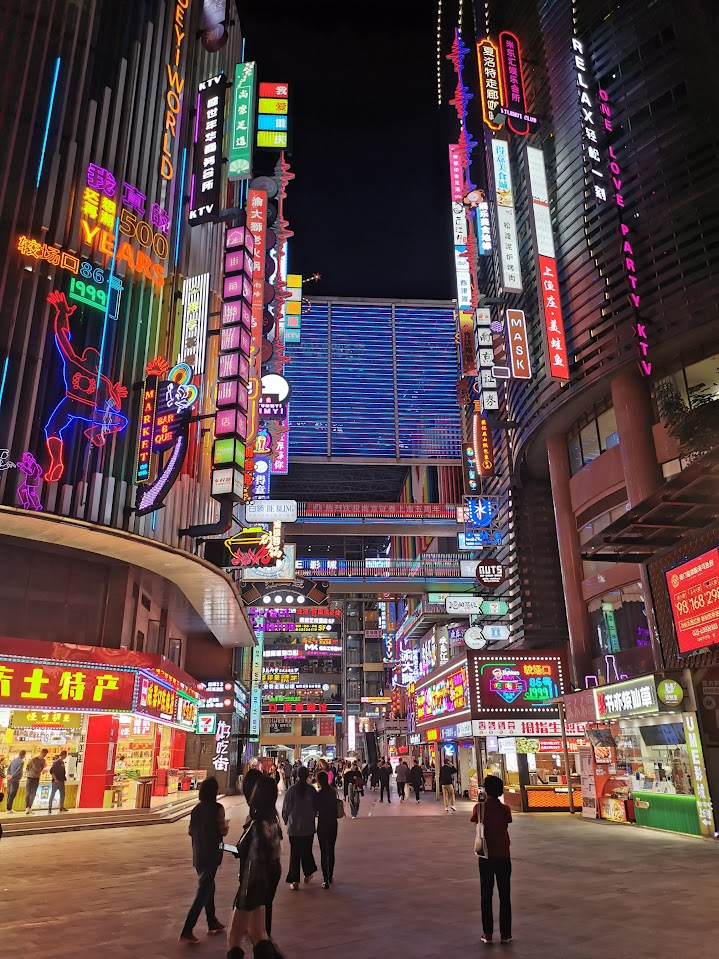
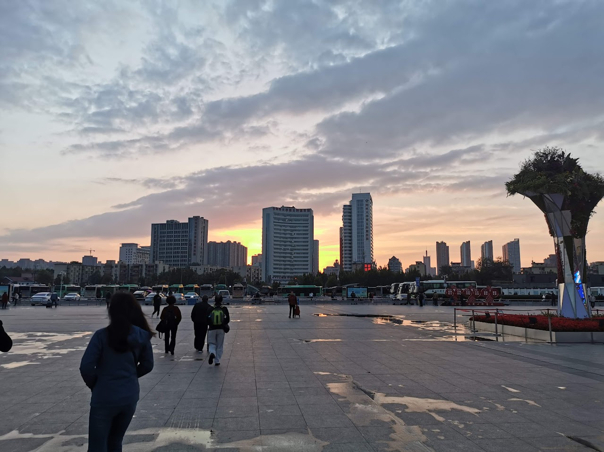
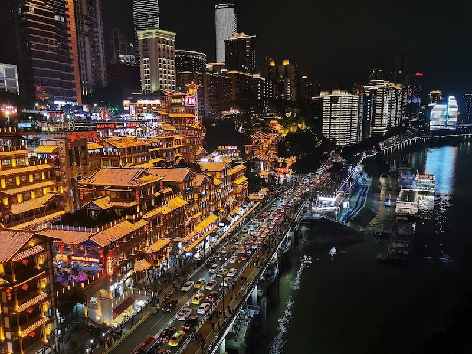
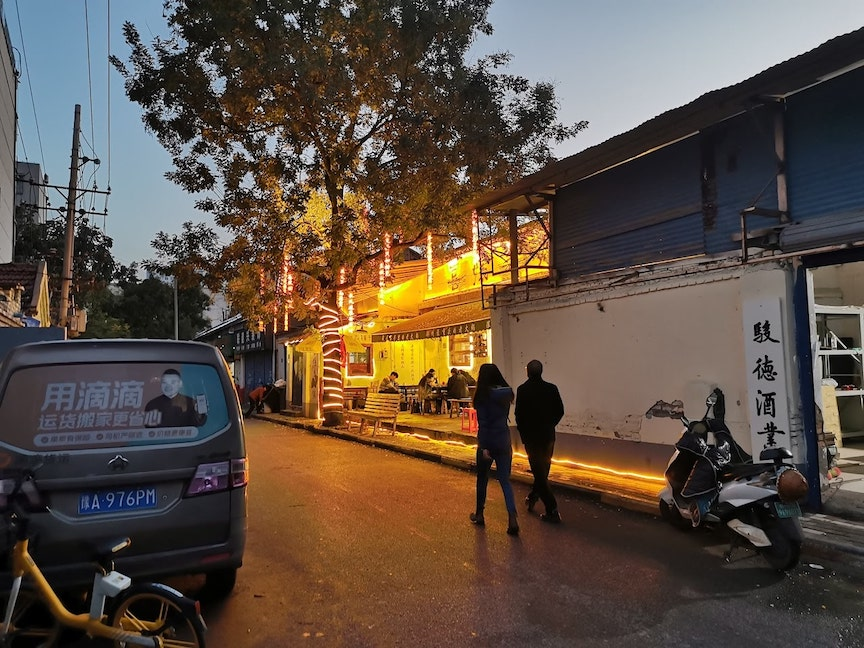
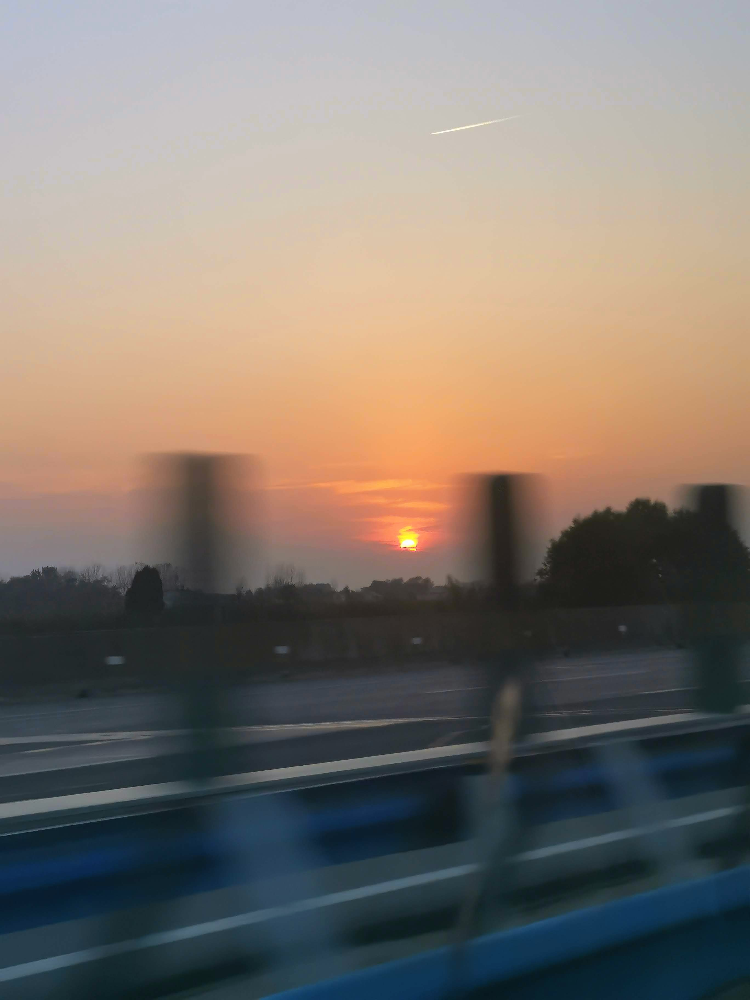

I recently travelled to China for a family matter. At a certain point during my trip, somewhere in the sliver of downtime between lunch and dinner, I started to notice how relaxed and at ease I had been feeling ever since I landed. I was able to mentally unwind and muster a depth of attention that I thought I had lost for good.

In hindsight, there are a few different explanations for this pleasant discovery. Most unsurprisingly, I was on vacation - and fully leaning into it. Work, bills, and all the myriad labours of keeping life humming along had been abandoned on the tarmac. Our outlook on the future is strongly tied to our abilities and the influence we have over our lives. For most of us, those things, in turn, are bound up with the stability and profitability of our careers. I had budgeted comfortably for the trip and so for the two weeks I was there, it was my privilege to stop worrying about the future.

The [Great Firewall](https://en.wikipedia.org/wiki/Great_Firewall) also helped. As a foreigner with no mobile data plan or Chinese social media accounts, I was finally able to take a break from the typical barrage of push notifications, messages, and emails which is such a common feature of life back home. My phone wasn't good for anything other than taking pictures, forcing me to pay attention to what was happening around me. Less distractions and less choices meant less fatigue, leaving me to consume the day in one long continuous take.

<figure>
  
  <figcaption>Chongqing - near Jiefangbei CBD.</figcaption>
</figure>

Most importantly, there was respite from the tyranny of happiness. The familiar jostling questions of "Am I happy?" and "Will X bring me happiness?" just seemed to fall away. Unlike what I'm accustomed to, I saw a terrific amount of time and money being collectively spent on things that no single individual wanted to do. But wanting or not wanting to do something seemed to have no bearing at all on whether people actually did it. Things got done not because every participant viewed them as conducive to their own wellbeing, but because they were commanded by custom, tradition, and their social status. Adopting a mindset like this means that instead of thinking about how each moment serves one's own pursuit of happiness, it becomes possible to think of other things.

For instance, we often pay lip service to the importance of gathering together and connecting with other people, but getting a group of 30-somethings to commit to meeting in meatspace is not easy. We seem to often value self-determination more highly than the necessity of investing in many of our relationships, believing that the former is a quicker route to happiness. You can test this for yourself by thinking back to the last time your plans with someone were suddenly cancelled. Were you relieved? What did you end up doing with that time instead? 

<figure>
  
  <figcaption>Zhengzhou train station.</figcaption>
</figure>

Despite being antithetical to the North-American mindset at times, it's valuable to prioritize things for the sake of preserving tradition, e.g. exchanging gifts, organizing trips, spending time with family, friends, coworkers. It can feel refreshingly organic when one's actions follow as a natural consequence of one's station in life and relationships with others. Knowing what is incumbent upon you to do saves you the agony of choosing what you __want__ to do or speculating what will bring you the most satisfaction. And if the culture around you doesn't value personal happiness as much as fulfilling social obligations, then you will ask yourself very different questions about life in your private moments. This situation surely seems hopelessly oppressive from the outside, but it can be liberating to have one's own desires fall in sync with the flow of tradition. If all are moving together, governed by the same values, individual triumphs and disappointments are diminished in favour of a collective focus and stability.

That being said, it's worth noting that this perspective on life (or at least the portion that extends to the workplace), seems to be most prevalent among boomers and Gen Xers. Certainly the millenials I talked to made it clear that they found the pressure to socialize and drink after work to advance their careers (a common phenomenon in any government-adjacent workplace, for instance) a source of immense frustration. To hell with the collective.

***

A central concept in philosopher Byung-Chul Han's book "The Burnout Society" is what the author calls "the achievement society". This is the society that we live in currently, as opposed to the societal model of the past - "the disciplinarian society". As Han puts it: 

> Today’s society is no longer Foucault’s disciplinary world of hospitals, madhouses, prisons, barracks, and factories. It has long been replaced by another regime, namely a society of fitness studios, office towers, banks, airports, shopping malls, and genetic laboratories. Twenty-first-century society is no longer a disciplinary society, but rather an achievement society [Leistungsgesellschaft]. Also, its inhabitants are no longer "obedience-subjects" but "achievement-subjects." They are entrepreneurs of themselves.

Han goes on to describe the effect on the individual of living in an achievement society: 

> The achievement-subject stands free from external instances of domination forcing it to work and exploiting it. It is subject to no one if not to itself. However, the absence of external domination does not abolish the structure of compulsion. It makes freedom and compulsion coincide. The achievement-subject gives itself over to freestanding compulsion in order to maximize performance. In this way, it exploits itself. Auto-exploitation is more efficient than allo-exploitation because a deceptive feeling of freedom accompanies it. The exploiter is simultaneously the exploited.
>
> ...According to this view, the depressive is one who is "exhausted by his sovereignty" — that is, no longer has the power to be his own master. The depressive is tired from the constant "need for initiative."

We're strong enough to lift anything so we choose to carry the weight of every possible future. How lovely it is then, to feel weak and powerless again. With limited money, limited access to financial infrastructure, and no cell network-enabled phone, I merely had time. Time away from the achievement society, time to have an original thought without having my thinking done for me by a server on a rack.

<figure>
  
  <figcaption>Chongqing - Hongyadong.</figcaption>
</figure>

Achievement society loves hustle porn. It loves vague ambitions and loathes the concreteness of small problems. So these became the object of my focus. While the pursuit of achievement is exhausting and tedious, entertaining dinner guests, drafting itineraries, and buying groceries is easy. That's especially true when all these things have an effortless edge drawn around them, it all ends when you get on a plane heading home.

Finally, the worries of the day arranged themselves in a leaping cascade of right angles and straight lines. The endless crush of optimization and tuning and production and evolving and improving melted into the joy of a small, concrete existence. If every second I spend at home folding laundry is time I'm not self-actualizing, then leaving tech behind quarantines me in an environment where bite-sized challenges abound, goals become manageable, and life becomes simple. My bone-brittle attention, ravaged by streams of clamouring voices, yielded to a comforting boundary, and my monstrous appetites fell in line. Instead of being dissolved in the internet, I acquired a more definite form.

***

The size of the goal is important, but its meaning is equally so. The goals in front of me involved resolving various claims on my time in an optimal way. And although social engagements can often be draining, they feel more worthwhile when inheriting a ritual or cultural significance. Even if the full history and weight of the event was unknown to me, having a name was enough to lend it a tangibility of which I was grateful to partake. For instance, welcoming someone coming from far way has the name of 接风(jiē fēng), literally 'catching the wind', and that name itself makes the event seem less incidental. Many of the things we did fell into a certain kind of framework and felt like the playing out or reenactment of a story written long ago rather than the arbitrary imposition of one will on another.

I'm grateful for rituals because they mediate the connection between us. Many of the people I talked to I might not have otherwise had a reason to converse with or I might not have had anything to say to them. But the fabric of a ritual changes that and weaves us all into a single garment. Navigating cultural barriers and logistical challenges becomes deliciously inevitable. As we partake in and co-create an experience that fulfills the ritual, we are woven together. The road is a long one, but I want to hear all about what you saw on the way.

<figure>
  
  <figcaption>Zhengzhou - hot pot restaurant in an alley.</figcaption>
</figure>

In "The Disappearance of Rituals", Han talks about the importance of rituals and their grounding influence:

> We can define rituals as symbolic techniques of making oneself at home in the world. They transform being-in-the-world into a being-at-home. They turn the world into a reliable place. They are to time what a home is to space: they render time habitable. They even make it accessible, like a house. They structure time, furnish it. In his novel Citadelle, Antoine de Saint-Exupéry describes rituals as temporal techniques of making oneself at home in the world:
>> And our immemorial rites are in Time what the dwelling is in Space. For it is well that the years should not seem to wear us away and disperse us like a handful of sand; rather they should fulfill us. It is meet that Time should be a building-up. Thus I go from one feast day to another, from anniversary to anniversary, from harvestide to harvestide as, when a child, I made my way from the Hall of Council to the rest room within my father’s palace, where every footstep had a meaning.

My time in China is always memorable to me as it is a collision between the mundane and the transcendent. The ritual gatherings at specific times, eating and drinking specific foods, give me a place to feel at home in the world, a place that's not as easy to find elsewhere.

Whether that has more to do with the yawning prairies of time I grew up in or with the way a less familiar place forces you to pay attention is hard to say. In any case, on this trip just as the ones before, I'm reminded to be more intentional about my gatherings and not to underestimate the importance of ritual. All we have is ourselves and each other, our words, our hands, and a cup of time.

<figure>
  
  <figcaption>Shanghai to Zhengzhou.</figcaption>
</figure>

I'm also reminded to structure my life around working on things that are meaningful and achievable. Meaningful goals connect me with other people and impact more than myself. Achievable goals are the ones with clear boundaries and a definition of done, not the doomed, futile abyss-gazing of Han's achievement subject.

We drove along the expressway for a long time, watching the wind turbines claw at a flaming tatter of sky. We tapered to a ritual, converged on a quiet belonging. One meaning and one achievement at a time, we ford the stream and make ourselves at home in the world. 

<em>Thanks to Aaron Ames for graciously reviewing an early draft of this post.</em>

 

---

### References

Han, Byung-Chul. _The Burnout Society._ Stanford University Press, 2015. 

Han, Byung-Chul. _The Disappearance of Rituals: A Topology of the Present._ Polity Press, 2020. 

